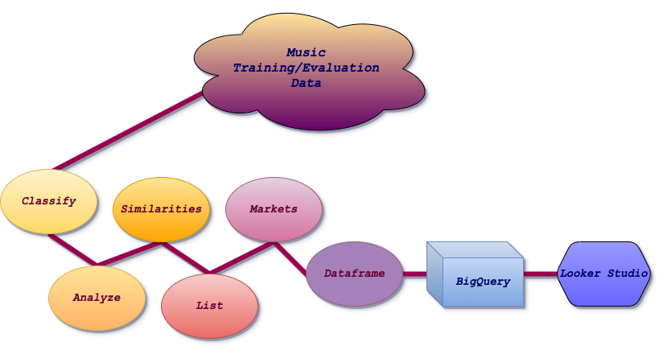
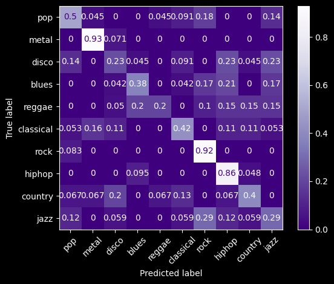
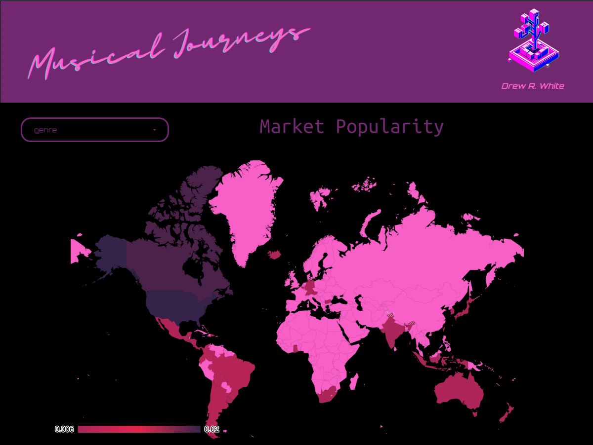
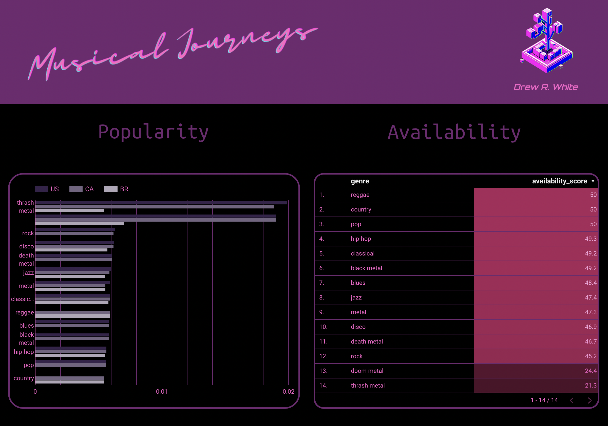

## Musical Journeys

#### By [Drew White](https://www.linkedin.com/in/drew-riley-white/)


## Contents
[Summary](#summary) |
[Technologies Used](#technologies-used) |
[Sources](#sources) |
[Description](#description) |
[Visualizations](#visualizations) |
[Goals](#goals) |
[Setup](#setup) |
[Known Bugs](#known-bugs) |
[License](#license)
### Links:
[Looker Dashboard](https://lookerstudio.google.com/reporting/d58436df-6658-44dd-98e2-5ec8c0674f1c)

## Summary:
Musical Journeys is a project that creates a music genre classification machine learning model, gives song recommendations based on what song you classify and suggests a place to visit where others have a similar taste in music.

## Technologies Used:


* Python
* Pandas
* Spotipy
* scikit-learn
* Librosa
* matplotlib
* BigQuery
* Looker Studio


## Sources:

[GTZAN Dataset - Music Classification](https://www.kaggle.com/datasets/andradaolteanu/gtzan-dataset-music-genre-classification)

## Description:

- Process followed for project:
     1. Load classification dataset.
     2. Classify data using machine learning with Python Library `scikit-learn`.
     3. Visualize and analyze accuracy results by creating a confusion matrix with `matplotlib` .
     4. Gauge similarites in the music with cosine similarity.
     5. List recommendations based on song chosen to analyze.
     6. Analyze markets and genre popularity by pulling select data from Spotify using Spotify API, `spotipy`.
     7. Put extracted data into `Pandas` dataframe and make transformations for readability.
     8. Load data to BigQuery using `Google Python Client`.
     9. Visualize findings in Looker Studio.


## Visualizations:

<br>

_A confusion matrix is a table that is commonly used to evaluate the performance of a machine learning model. It displays the number of true positives, true negatives, false positives, and false negatives for a given set of predictions when compared to the actual outcomes._





## Goals
_I would like to keep adding to this project and have the following goals:_
1. In the data that I analyzed, no meta data for Artist or Title was present. I would like to find a way to analyze the music and pull that information. I made attempts to do this with the `Shazam API` and `AcoustID` but did not have any luck.
2. Continue training this model to make the accuracy score higher with all genres.
3. With genres in mind, I would like to bring sub-genres into the model.
4. Explore the possibilities of creating user interaction with this pipeline. Maybe this could be done retrofitting the code to be a flask application that either: allows the user to upload a song, or choose a song in a database to explore.
5. Pull more market data and explore different means to do so. I was able to get a general market popularity rating but I feel like some missing information that could be placed would change results. For example, Finland is said to be the most passionate country about metal music. My results showed Canada and USA markets.

## Setup

* Clone by inputting following into terminal: 
  ```bash
  git clone https://github.com/Drewrwhite/musical_journeys.git
  ```
* Navigate to directory:
  ```bash
  cd <directory>
  ```
* Create a virtual environment:
  ```bash
  python3.7 -m venv venv
  ```
* Activate virtual environment:
  ```bash
  source venv/bin/activate
  ```
* Install requirements:
  ```bash
  pip install -r requirements.txt
  ```
* Create `data` directory:
  ```bash
  mkdir data
  ```
* Open directory in VSCode:
  ```bash
  code .
  ```
* Download data from Kaggle and save in `data` directory:
  ```bash
  https://www.kaggle.com/datasets/andradaolteanu/gtzan-dataset-music-genre-classification
  ```

</br>

## Known Bugs

* No known bugs

</br>

## License

[MIT](./license.txt)

_If you find any issues, please reach out at: **d.white0002@gmail.com**._

Copyright (c) _2023_ _Drew White_
