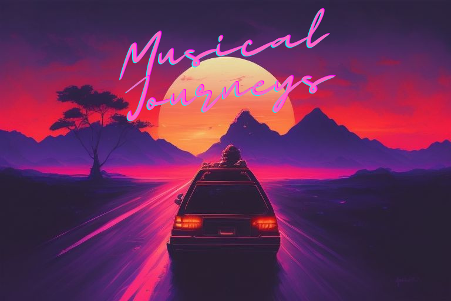

## Musical Journeys

#### By [Drew White](https://www.linkedin.com/in/drew-riley-white/)

## Contents
[Summary](#summary) |
[Technologies Used](#technologies-used) |
[Sources](#sources) |
[Description](#description) |
[Visualizations](#visualizations) |
[Known Bugs](#known-bugs) |
[License](#license)
### Links:
[Looker Dashboard](#)
## Summary:
Musical Journeys is a project that creates a music genre classification machine learning model, gives song recommendations based on what song you classify and suggests a place to visit where others have a similar taste in music.

Steps will possibly be:
1. Profile the classification data
2. Split data into training and testing sets
3. Reshape and scale input features
4. Train and evaluate model
5. Visualize the confusion matrix
6. Use cosine_similarity to get similar tracks
7. Connect to Spotify API with spotipy
8. Use playlist and market data to find what markets each genre is most popular in
9. Organize results to create a travel recommendation and playlist based on whatever genre the song is classified as
10. Create looker visualizations based on popularity and market and possible similarity scores
11. If I have enough time I might try to see if I can create user interfacing with flask

## Technologies Used

* Python
* Pandas
* Spotipy - lightweight Python library for the Spotify Web API
* scikit-learn - tools for predictive data analysis
* Librosa -python package for music and audio analysis
* matplotlib

## Sources:

[GTZAN Dataset - Music Classification](https://www.kaggle.com/datasets/andradaolteanu/gtzan-dataset-music-genre-classification)

## Description:
## Visualizations

## Known Bugs

* No known bugs

 

## License

[MIT](./license.txt)

_If you find any issues, please reach out at: **d.white0002@gmail.com**._

Copyright (c) _2023_ _Drew White_
